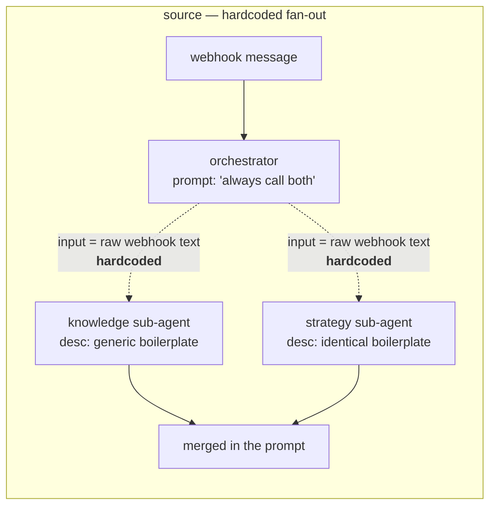
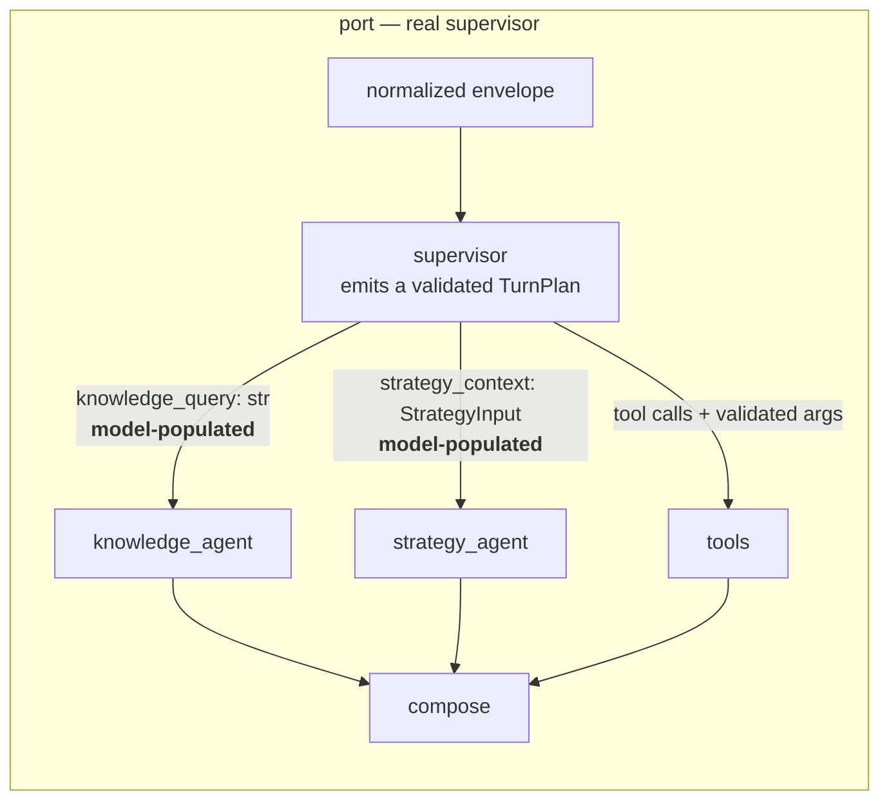
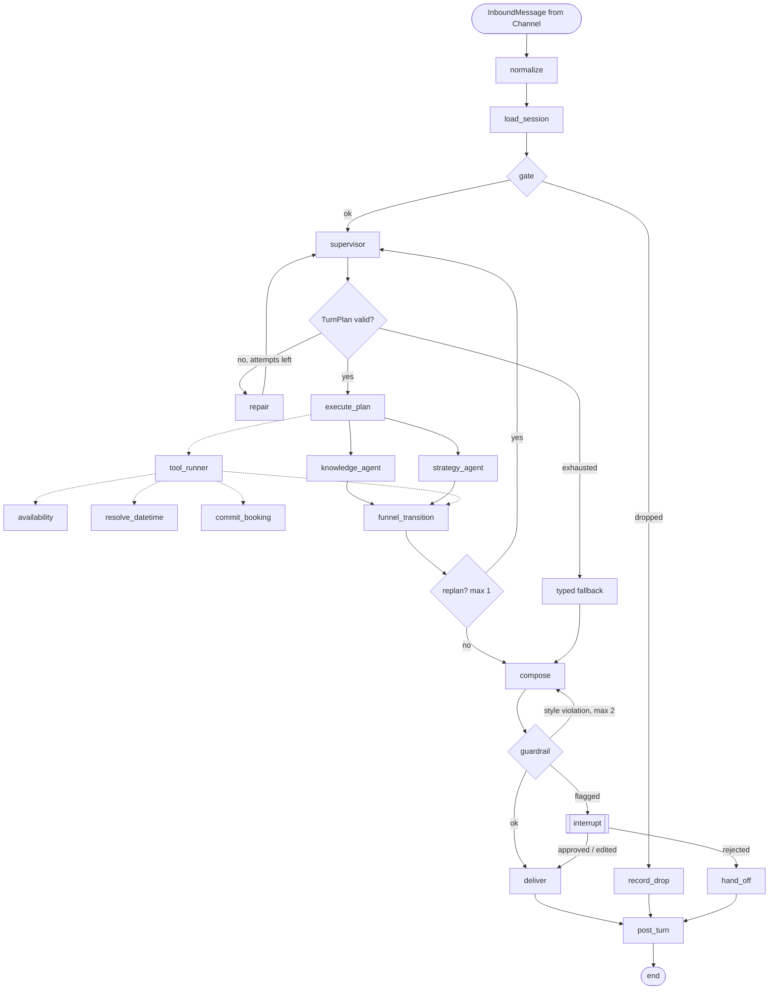
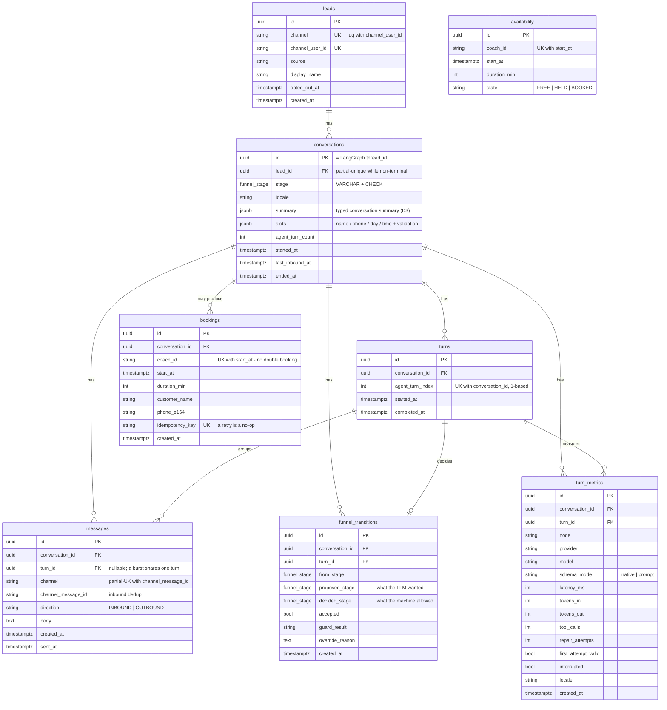

# Architecture

## The delta this project exists to demonstrate

The source system's orchestrator is described as an agent that delegates to two
sub-agents. It does not delegate. Both sub-agent inputs are hardcoded to the raw
webhook text:

```
$('Insta Trigger').item.json.body.entry[0].messaging[0].message.text
```

The model never populates either argument, and both sub-agents carry *identical*
boilerplate tool descriptions ("a specialized tool for processing the user's
request"), so even a model that could choose has no basis for choosing. The
orchestrator's own prompt instructs it to always call both. That is a fan-out
with an LLM stapled to the front, not delegation.





**In one sentence:** the orchestrator now decides *what to ask* each sub-agent,
and *whether to ask it at all*. In the source neither was possible.

A second number worth stating with its arithmetic rather than as a bare
percentage: of the source's 149 nodes, 68 — 34 Google Sheets error-appends plus
the 34 timestamp nodes that exist only to feed them — are error handling, because
n8n has no exception handling. That is 46%, and all 68 are replaced by
`app/logging.py`.

---

## The message graph

The design target is below; what is *built* is the subset marked with a solid
box. The dashed nodes — `tool_runner` and its three tools, the repair-loop
replan — are implemented as functions with their own tests but are not yet
dispatched from a node (`docs/KNOWN_GAPS.md` §4).




`thread_id` for the checkpointer is `conversations.id` — not the channel sender
id. See decision D4.

---

## The funnel state machine

The LLM proposes; this table decides. Every turn writes a `funnel_transitions`
row with both, so `proposal_override_rate` is a real metric.

Rows marked **Q** are deviations from the source, decided at the Phase 1
checkpoint and recorded in decision D18–D21. The table is a data
structure (`app.funnel.transitions.TRANSITION_TABLE`), and a test asserts every
row below is actually reachable — documentation that lies is worse than none.

| From | To | Guard | Trigger | |
|---|---|---|---|---|
| `NEW` | `OPENER` | first message carries no actionable intent | proposal → guard | default |
| `NEW` | `VALUE` | first message contains a direct answerable question | proposal → guard | **Q1** |
| `NEW` | `TRANSITION` | first message contains an explicit booking request | proposal → guard | **Q1** |
| `OPENER` | `VALUE` | inbound reply received | system | |
| `VALUE` | `VALUE` | `agent_turn_index < FUNNEL_TRANSITION_TURN` | proposal accepted | |
| `VALUE` | `TRANSITION` | `agent_turn_index >= FUNNEL_TRANSITION_TURN` | system | |
| `VALUE` | `TRANSITION` | user asks to book | system | early exit |
| `VALUE` | `TRANSITION` | `agent_turn_index >= FUNNEL_HARD_CAP` | system | proposal ignored |
| `TRANSITION` | `TRANSITION` | offer declined, or no response yet | system | |
| `TRANSITION` | `TRANSITION` | no engagement — re-ask | system | **Q5** |
| `TRANSITION` | `TRANSITION` | re-asks spent — stop asking, keep replying | system | **Q5** |
| `TRANSITION` | `SLOT_FILLING` | a slot value was supplied | proposal → guard | **Q2** — no acceptance turn |
| `TRANSITION` | `SLOT_FILLING` | engaged affirmatively with the offer | proposal → guard | **Q5** |
| `SLOT_FILLING` | `SLOT_FILLING` | ≥1 slot empty or invalid | system | |
| `SLOT_FILLING` | `HANDED_OFF` | phone attempts > `1 + PHONE_REASK_LIMIT` | system | **Q3** |
| `SLOT_FILLING` | `AWAITING_CONFIRMATION` | all four slots valid | **system only** | |
| `AWAITING_CONFIRMATION` | `BOOKED` | `commit_booking` returned a committed receipt | **system only** | |
| `AWAITING_CONFIRMATION` | `SLOT_FILLING` | slot taken → re-offer | system | |
| any non-terminal | `OPTED_OUT` | opt-out detected | detector | pre-emptive |
| any non-terminal | `HANDED_OFF` | guardrail escalation | system | pre-emptive |
| any non-terminal | `ABANDONED` | `CONVERSATION_IDLE_HOURS` elapsed | scheduler | pre-emptive |
| `OPTED_OUT` | `OPTED_OUT` | user-initiated message; reply only | system | **Q4** |

### The rules that carry the weight

**`AWAITING_CONFIRMATION` and `BOOKED` are unreachable by proposal.** Rejected
before any other rule is evaluated, so no later branch can honour one by
accident. The booking confirmation sentence is emitted by the `BOOKED`
transition, which fires only on a committed row — so a hallucinated confirmation
is not unlikely, it is unreachable.

**Pre-emptive signals outrank everything, and their order among themselves is
load-bearing:**

```
opt-out  >  guardrail escalation  >  idle expiry  >  every stage rule
```

A lead who withdraws on turn 7 opts out rather than receiving the forced ask.
A lead who withdraws on the same turn a guardrail fires lands in `OPTED_OUT`,
not in a human review queue — otherwise a withdrawn lead gets followed up by a
person, which is worse than the automated pitch we just prevented.

**`agent_turn_index` is 1-based and names the turn being produced.** `decide()`
runs before `compose`, so the stage it returns governs the reply about to be
sent. `FUNNEL_TRANSITION_TURN=5` means "the 5th agent reply is the consultation
ask"; `conversations.agent_turn_count` is the count already *sent*, so it reads
N-1 during turn N. An off-by-one here changes behaviour in every conversation,
so it is asserted rather than assumed.

**The funnel never resumes after an opt-out.** Business-initiated messaging is
blocked entirely; a user-initiated message is still answered, minimally. That
asymmetry — inbound permitted, outbound blocked — is what distinguishes
respecting an opt-out from ignoring the person.

**Recovery is bounded but not stingy.** Three phone attempts, then a human. One
re-ask is not a recovery ladder; handing off on every typo makes the interrupt
queue useless for the cases that need a person.

---

## Burst aggregation

Consecutive inbound messages with no reply between them are **one turn**.

```
  inbound "hey"          ─┐
  inbound "saw ur reel"   ├─ one InboundEnvelope ─→ one agent turn ─→ index +1
  inbound "the one about knees" ─┘
```

Intent is classified on the aggregated text, so a greeting followed by a real
question is a question rather than an empty opener. `agent_turn_index` counts
replies, so a chatty lead does not hit `FUNNEL_HARD_CAP` faster than a terse
one.

| Producer | Mechanism |
|---|---|
| eval runner | structural: consecutive `inbound:` entries in the YAML |
| live channel | debounce on `BURST_WINDOW_SECONDS` (default 5), window restarts per message |
| CLI | explicit: type lines, blank line submits the burst |

The source replied once per message, because each Instagram webhook fired the
workflow independently. See decision D24.

---

## Data model

Eight tables. The source stored its state in two Google Sheets; the other 46
sheets nodes were error logging.



### The four constraints that carry weight

| Constraint | What it prevents |
|---|---|
| `uq_conversations_one_live_per_lead` (partial unique) | two live funnels for one lead when messages arrive concurrently |
| `uq_messages_channel_msgid` (partial unique) | a redelivered at-least-once webhook producing a second reply |
| `uq_bookings_coach_start` | double-booking, at the database rather than in a check-then-write |
| `uq_bookings_idempotency` | a retried `commit_booking` creating a second booking |

The last three are all bugs the source system has.

### Not tables

Tool calls, gate drops and interrupts go to structured logs. The v1 design's
`conversation_summaries` and `slots_collected` are JSONB columns on
`conversations` — both were strictly 1:1 with a conversation. See
decision D8.

---

## The guardrail node

One node, two severities, two different consequences. The split is the whole
design: a reply that is three sentences long is a formatting mistake the model
can fix itself; a reply that claims to be a human is not.

| severity | violations | consequence |
|---|---|---|
| `style` | `too_long`, `too_short`, `multiple_sentences`, `too_many_emoji`, `adjacent_emoji`, `missing_disclosure` | re-compose, at most `GUARDRAIL_RECOMPOSE_LIMIT` times, then send `safe_template()` |
| `safety` | `claims_to_be_human`, `first_person_credential`, `unlisted_link`, `unearned_confirmation`, `low_confidence` | `interrupt()` — a human approves, edits or rejects |

On exhaustion the draft is *discarded*, not sent: `safe_template()` says
nothing that could be wrong and hands the turn to a person. A draft that still
breaks the style contract after two attempts is not the best available answer,
it is the one the model could not fix.

Style violations loop `compose ⇄ guardrail`. Safety violations never loop: a
re-compose that "fixes" an impersonation claim is a model deciding it is now
allowed to say the thing, which is exactly the failure the check exists for.

### Confidence is computed, not self-reported

`effective_confidence()` takes the model's own number and subtracts what
actually happened during the turn:

```
penalty = 0.15·repair_attempts
        + 0.25·tool_failures
        + 0.10·(proposal was overridden)
        + 0.05·min(unresolved_slots, 4)
```

A self-report is a claim, not evidence. A reply produced after two schema
repairs and an overridden stage proposal does not get to call itself confident,
and once its effective confidence drops below `CONFIDENCE_FLOOR` it goes to a
human regardless of what the model said about itself.

The `unresolved_slots` term only counts inside `SLOT_FILLING` and
`AWAITING_CONFIRMATION`. Counting it earlier sent *every opening turn* to a
human — four slots are missing at turn 1 because nothing has been asked for
yet, which is the normal state of the world rather than evidence of trouble.
That bug shipped, passed every unit test, and was found only by running the
interactive demo (decision D40).

### The interrupt

`reason_for()` returns one of `booking_approval`, `safety_flag`,
`low_confidence`, `slot_recovery_exhausted`, in that precedence order — a
reviewer should see the sharpest reason, not the first one matched.

`parse_resume()` fails closed. Anything that is not a well-formed
`HumanDecision` becomes `REJECT`: a malformed resume payload must not be able
to approve a message.

Two rules the transports must honour, and one they got wrong first:

- **Withholding the draft is the point.** `HTTPChannel` originally returned the
  flagged draft in the response body. Putting it in the body *is* sending it,
  so an interrupted turn returns `reply: null` and the reason.
- **`interrupt()` precedes `post_turn`.** Nothing about an interrupted turn is
  persisted. That is correct — an unapproved reply is not a turn that happened
  — but it means an interrupt loop leaves no trace in the tables, and D40 was
  invisible for exactly that reason.

---

## The tools

Four tools, three of them not yet dispatched from a node. The contracts and
their failure paths are the reviewable part; the dispatch wiring is
`docs/KNOWN_GAPS.md` §4.

| tool | returns | the interesting failure |
|---|---|---|
| `validate_phone` | `E.164` or a typed `PhoneError` | `0341 9876543` parses fine and is a **landline** — valid, wrong kind |
| `resolve_datetime` | `RESOLVED` / `AMBIGUOUS` / `UNPARSEABLE` | `"can we do 9"` is ambiguous between 09:00 and 21:00; the source silently picked one |
| `check_availability` / `list_free_slots` | free slots from a Postgres table | no calendar integration, by instruction |
| `commit_booking` | the booked slot, or a typed conflict | `SELECT … FOR UPDATE` plus an idempotency key |

Every tool returns a typed result rather than raising. A tool failure is
information the turn needs — it feeds `tool_failures` into the confidence
penalty above — not an exception that ends it.

Two findings worth stating because they are counter-intuitive:

- **Letters are rejected before parsing.** `0151 23oh4a78` is *valid* to
  `phonenumbers`, which maps vanity letters to digits. A German lead does not
  type a vanity number; that is a typo, so the validator rejects
  non-digits itself rather than trusting the library's answer.
- **`"next tuesday"` said on a Tuesday is ambiguous**, not a date. It resolves
  to two candidates and asks, because guessing wrong here books a stranger into
  the wrong week.

---

## Layout

```
app/
  config.py        pydantic-settings; every behavioural knob, validated at startup
  logging.py       structlog; replaces 68 n8n error-logging nodes
  cli.py           `doctor`, `chat`, `turn`, `snapshot`, `models`
  llm/
    base.py        LLMProvider protocol, LLMResult, schema helpers
    gemini.py      default, tested; GEMINI-SPECIFIC coupling marked inline
    ollama.py      documented, untested, no number in the README comes from it
    scripted.py    rule-based, no key required; refused by the eval runner
    factory.py     provider selection
  db/
    base.py        engine, session factory
    models.py      the eight tables
  funnel/
    stages.py      FunnelStage, TERMINAL_STAGES, SYSTEM_ONLY_STAGES
    transitions.py the decision table; ProposableStage; decide()
  graph/
    state.py       ConversationState, Slots, TurnPlan, reducers
    nodes.py       the eleven nodes and their routers
    build.py       StateGraph wiring, AsyncPostgresSaver, run_turn()
  tools/
    phone.py       E.164 via `phonenumbers`; typed PhoneError
    datetime_tool.py  RESOLVED / AMBIGUOUS / UNPARSEABLE
    booking.py     FOR UPDATE + idempotency key; seed_availability
  guardrails/
    checks.py      style vs safety, effective_confidence()
    interrupt.py   InterruptReason, parse_resume() (fails closed)
  memory/
    summary.py     TypedSummary; merge + supersession (persisted, not populated)
  channels/
    base.py        Channel protocol
    envelope.py    InboundMessage / OutboundMessage, BurstBuffer
    cli.py         the interactive loop used for the restart demo
    http.py        FastAPI: /health, /inbound, /conversations/{id}
    instagram.py   NotImplementedError with the real contract in the docstring
migrations/        Alembic; 0001 written by hand (partial indexes)
evals/
  schema.py        the golden-set file format, closed predicate vocabulary
  predicates.py    deterministic implementations; judged ones -> UNVALIDATED
  judge_schema.py  Wilson interval, judge_verdict(), the draft/reviewed rule
  validate.py      `python -m evals.validate --strict`
  run.py           the runner: --dry-run, --resume, --baseline, --only
  golden/          eight conversations
  judge/           five judge sets, all `status: draft`
scripts/
  acceptance.sh    ruff, suite twice on host, golden set, suite in container
tests/             456 tests
docs/
  KNOWN_GAPS.md    every deliberate omission and unresolved defect
  OPEN_QUESTIONS.md
```
